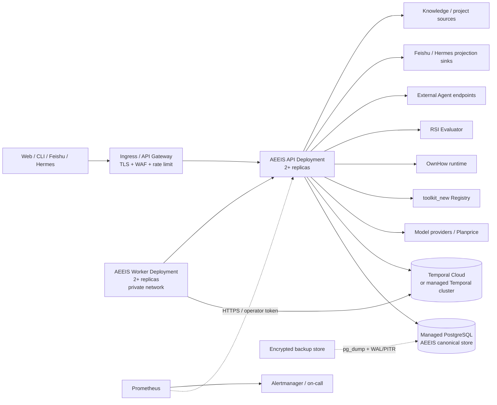

# AEEIS 部署方案

**状态：建议方案**  
**适用版本：AEEIS 0.1.x**  
**更新时间：2026-09-22**

本文定义 AEEIS 从本地验收、预生产到生产的部署边界、拓扑、发布和恢复方式。它描述的是部署架构，不把当前的 Fixture Compose 变成生产配置。

## 1. 结论与选择

生产采用 Kubernetes（或具备等价能力的容器平台），AEEIS API 和 Temporal Worker 分开部署，PostgreSQL 使用托管高可用服务，Temporal 优先使用 Temporal Cloud；如果因数据驻留、网络或成本原因不能使用 Temporal Cloud，再部署独立的 Temporal 集群。

推荐的第一版生产形态是单区域、单租户或少量租户、跨可用区高可用：

- AEEIS API：2 个副本，挂在 Ingress 后，只提供 HTTP、领域提交、查询、SSE 和管理接口。
- AEEIS Worker：2 个副本，只连接 Temporal 和 AEEIS 内部 HTTPS 接口，不接受公网流量。
- PostgreSQL：17 或兼容版本，跨可用区主备、自动备份和 PITR；AEEIS 领域数据、记忆、知识、Agent Registry、授权账本和 Projection Outbox 共用一个 AEEIS 数据库，使用独立数据库用户。
- Temporal：生产 namespace、固定 task queue、启用 Worker Versioning。Temporal 持有长时 Workflow 的执行历史和 Timer，AEEIS PostgreSQL 持有领域事实。
- 外部依赖：真实模型 Provider、Planprice、OwnHow、toolkit_new Registry、RSI Evaluator、Feishu/Hermes 和外部 Agent 均通过 HTTPS 或受管控的机器间协议接入。
- 观测：Prometheus 抓取 AEEIS `/metrics`，告警交给现有监控系统或 Alertmanager；Grafana 只读取监控数据，不参与业务控制。

Redis 不作为首版事实存储或一致性协调器。当前正确性边界由 PostgreSQL 行锁/CAS、幂等 Receipt、Outbox 和 Temporal 提供；只有在明确出现缓存、限流或高吞吐短期状态的容量瓶颈后，才单独引入 Redis，并且不得把 Redis 作为 Goal、Run、Authorization 或 RSI 状态的唯一来源。

## 2. 推荐拓扑



Ingress 是唯一公网入口。Temporal、PostgreSQL、Worker health endpoint、外部内部服务和 metrics endpoint 均不直接暴露公网。Feishu/Hermes 的入站 webhook 也先经过 Ingress，再由 AEEIS 校验签名、路由和发送者身份。

## 3. 进程职责与扩缩容

### API Deployment

API 进程运行 `node dist/server.js`，负责：

- HTTP API、认证、租户和 Room 权限检查；
- Goal、Plan、Task、Run、Receipt、Evidence、Brain、Knowledge、Agent Registry、RSI 等领域事实的读写；
- 将长时执行提交给 Temporal；
- Projection Outbox、提醒、DAG scheduler、RSI proposal scanner 和协作 trigger scanner 的可恢复 pump。

这些 pump 使用 PostgreSQL claim/CAS、幂等键和 cursor 保护并发。多个 API 副本可以同时运行，但容量评估必须把每个副本的轮询、数据库连接和外部探针开销计算进去。部署初期保持所有副本启用 pump，以便滚动发布期间仍有处理能力；当吞吐量扩大后，可增加独立 `aeeis-control-pump` Deployment，并为 API 增加显式的 pump 角色开关，作为后续工程项。

API 的 `/health` 只表示进程存活；`/readyz` 表示核心依赖可用。Ingress 的 readiness 探针必须使用 `/readyz`，不能用 `/health` 代替。`/metrics` 通过内部网络和 operator Principal 访问。

### Temporal Worker Deployment

Worker 运行 `node dist/temporal/worker.js`，负责 Temporal polling 和 Activity 执行。它不保存领域状态，不接受用户请求，也不应挂到公网 Ingress。Worker 只需要：

- 访问 Temporal namespace/task queue；
- 通过 `AEEIS_INTERNAL_URL` 访问 API 的内部 HTTPS 路由；
- 访问 Activity 所需的模型、工具、知识和外部 Agent 依赖；
- 暴露绑定在私网的 `4324/health` 和 `4324/readyz`。

Worker 副本数根据 Temporal task queue backlog、Activity 延迟和外部 Provider 并发限制调整。扩容 Worker 不等于提高模型 Provider 配额，生产必须同时设置 Provider 级并发、租户级预算和 AEEIS 全局预算。

### Projection 与后台任务

Projection Outbox 的 canonical 状态在 PostgreSQL，外部 sink 的交付使用原始幂等键。Feishu、Hermes 和其他 sink 失败时只重试 outbox，不回写或删除领域事实。Knowledge embedding reindex、备份上传和长时间恢复演练属于 operator job，不放入用户请求路径。

## 4. 数据边界

PostgreSQL 是 AEEIS 的生产事实源，至少包括：

- Goal、Plan、Room、Run、Receipt、Memory、Context Manifest 和 Projection Intent；
- Task dispatch reservation、DAG scheduler 状态、Reminder、Session Event 和 changefeed cursor；
- Agent Registry、Delegation Grant、预算账本、声誉观察和审计；
- Brain JSONB 状态、Knowledge 记录、Project Source checkpoint、RSI proposal claim 和 activation 状态。

Brain semantic index、Knowledge pgvector index 和其他 embedding 索引是可重建的派生数据。备份中必须包含其配置和 cursor，但恢复时可以先恢复 canonical 数据，再执行受控 reindex。

Temporal history 不替代 AEEIS 领域事实。长时 Workflow 的业务状态、授权、Receipt、Evidence 和 reconcile 边界必须落 PostgreSQL；Temporal 只负责 durable execution、Timer、Signal、Retry 和 Worker Versioning。

生产数据库连接串应使用 TLS、最小权限用户和连接池。部署侧应设置连接上限、连接超时、statement timeout 和空闲连接回收；API 与 Worker 的连接池总和不得超过数据库实例的 `max_connections`，并为迁移、备份和管理连接预留余量。

## 5. Kubernetes 资源边界

建议建立独立 namespace，例如 `aeeis-prod`，并将资源拆为以下对象：

| 资源 | 建议职责 | 公网暴露 |
| --- | --- | --- |
| `aeeis-api` Deployment + Service | HTTP、领域读写、投影和 scanner | 仅通过 Ingress |
| `aeeis-worker` Deployment | Temporal polling 和 Activity | 否 |
| `aeeis-api-pdb` | 滚动发布时保留至少一个 API 副本 | 不适用 |
| `aeeis-worker-pdb` | 滚动发布时保留至少一个 Worker 副本 | 不适用 |
| `aeeis-migrate` Job | 发布前执行数据库迁移/结构检查 | 否 |
| `aeeis-backup` CronJob | 触发备份、校验、上传和保留策略 | 否 |
| `aeeis-knowledge-reindex` Job/CronJob | 有界 embedding reindex | 否 |
| `Secret` / 外部 Secret Store | 凭证和签名密钥 | 否 |
| `NetworkPolicy` | 限制 API、Worker、数据库和外部依赖访问 | 不适用 |

API 和 Worker 镜像使用同一不可变 image digest；通过 `AEEIS_BUILD_ID` 区分 Temporal Worker 版本。容器使用 Dockerfile 中的非 root `node` 用户，并设置只读根文件系统；只有确需写入的临时目录使用 `emptyDir`。生产不挂载 fixture、源码或宿主机 Docker socket。

初始资源只作为容量起点，不能当作 SLA：API 每副本 `500m CPU / 512Mi` request、`2 CPU / 2Gi` limit；Worker 每副本 `1 CPU / 1Gi` request、`4 CPU / 4Gi` limit。上线后按 API p95、Temporal backlog、Node heap、数据库连接和 Provider 限流调整。模型调用本身的等待时间不能用 CPU 利用率单独推断容量。

## 6. 生产配置与 Secret

配置分为四类，禁止把生产 Secret 写进镜像、Git、Helm values 或 ConfigMap：

1. **核心必需配置**：`AEEIS_ENV=production`、`AEEIS_HOST=0.0.0.0`、`AEEIS_PUBLIC_HOSTS`、`DATABASE_URL`、`AEEIS_RUNNER=temporal`、`TEMPORAL_ADDRESS`、`TEMPORAL_NAMESPACE`、`AEEIS_TASK_QUEUE`、`AEEIS_BUILD_ID`、`AEEIS_TEMPORAL_USE_VERSIONING=1`。
2. **认证配置**：优先 OIDC 的 `AEEIS_OIDC_ISSUER`、`AEEIS_OIDC_AUDIENCE`、`AEEIS_OIDC_JWKS_URL`；静态 token 仅用于受限安装或迁移窗口。OIDC 和静态 token 不能同时启用。
3. **内部信任配置**：`AEEIS_WORKER_TOKEN`、`AEEIS_INTERNAL_URL`、`AEEIS_TEMPORAL_WORKER_HEALTH_URL`、`AEEIS_TRUSTED_HOSTS`、`AEEIS_TRUSTED_ORIGINS`。Worker health URL 和内部 API 在生产必须使用 HTTPS。
4. **外部依赖凭证**：模型 Provider/API key、Planprice、toolkit Registry token 和 root public JWK、OwnHow runtime、RSI Evaluator、Feishu/Hermes、Agent OAuth/HMAC、Knowledge/Project Source 凭证。每个依赖单独的 Secret、访问范围和轮换周期。

所有 Secret 通过外部 Secret Manager 或 Kubernetes External Secrets 注入。代码支持的 `_FILE` 形式优先用于长 Secret；直接环境变量只用于不敏感配置。Secret 轮换采用双 key 窗口：先发布同时接受旧/新 key 的版本，再切换调用方，最后撤销旧 key。Agent grant、callback HMAC、toolkit root key 和 Feishu/Hermes signing key 必须保留审计记录。

生产必须满足以下启动约束：

- `AEEIS_DEMO_MODE=0`，不配置本地 Fixture URL；
- 所有非 loopback 外部端点使用 HTTPS；
- toolkit Registry 开启签名校验并注入独立的 Ed25519 root public JWK；
- RSI proposal synthesis 若开启，必须配置独立的 `AEEIS_RSI_EVALUATOR_URL`；
- Temporal Worker Versioning 开启，并为 Build ID 选择明确 rollout；
- `AEEIS_HOST=0.0.0.0` 时必须设置准确的 `AEEIS_PUBLIC_HOSTS`；
- 不使用 Compose 中的默认密码、固定 worker token 或固定 fixture model。

完整变量清单以 [`.env.example`](../../.env.example) 为准；部署仓库应维护一份脱敏后的生产 values 示例，并在 CI 中执行配置校验。

## 7. 网络与安全策略

网络分为四个区域：Ingress、API、Worker/后台、数据与外部依赖。

- Ingress → API：只允许 443；启用 TLS、请求体大小限制、超时、速率限制和 WebSocket/SSE 所需的连接策略。
- API → PostgreSQL/Temporal/外部服务：仅允许命名的 egress；拒绝任意 URL 由用户请求直接指定。
- Worker → API：只允许内部 Service/私网域名，携带 `AEEIS_WORKER_TOKEN`，校验 Host 和 TLS。
- Prometheus → API：只允许 `/metrics`，使用 operator Principal bearer token 和受信 CA；不要把 token 放在 URL 或 query 中。
- Feishu/Hermes/Agent callback → Ingress：验证签名、时间窗、幂等键、租户和 route；公开 Run ID 不构成授权。

API 的公网 Host allowlist、OIDC tenant/role claim、Room membership、Agent Card admission、Delegation Grant 和 privacy classification 共同形成访问边界。WAF 或 service mesh 只能补充网络控制，不能替代 AEEIS 自身授权校验。

## 8. Temporal 生产策略

Temporal 使用专用 namespace，例如 `aeeis-prod`，并为每个环境使用独立 task queue。生产禁止使用 `default` namespace 作为长期配置。

每次 Worker 发布遵循以下顺序：

1. 用新 image 在预生产加载旧 history，执行 `npm run temporal:replay` 和工作流测试。
2. 为新 Worker 设置新的 `AEEIS_BUILD_ID`，先用 `AEEIS_TEMPORAL_BUILD_ID_ROLLOUT=bootstrap` 或 `new-default` 注册兼容集。
3. 需要处理旧 history 时使用 `compatible`，并设置 `AEEIS_TEMPORAL_COMPATIBLE_WITH`；确认兼容后再逐步转移任务。
4. 观察 backlog、失败率、Activity unknown、Run reconcile 和业务指标，再执行 `promote`。
5. 保留旧 Build ID 直到所有旧 history、长时 Timer 和人工暂停 Run 都越过兼容窗口；确认无回滚需要后再退役。

API 发布与 Worker 发布分开回滚。API 可以先回滚到上一镜像；Worker 回滚必须保持旧 Build ID 可调度，不能直接删除 Temporal 中仍有 history 的兼容版本。Temporal Cloud 或集群升级也必须作为独立变更，不能与 AEEIS 业务版本无审查地绑定。

## 9. 数据库迁移、发布与回滚

数据库迁移采用 expand/contract：先添加兼容结构，再发布同时读写新旧结构的应用，完成数据回填和校验后再清理旧结构。现有 adapter 使用 PostgreSQL advisory migration lock，可防止多个 API/Worker 同时执行 DDL；生产仍应把迁移作为显式 `aeeis-migrate` Job，以便审计和失败阻断。

推荐发布流水线：

1. CI 执行 `npm run typecheck`、`npm test`、PostgreSQL 集成测试、`npm run build`、镜像扫描、`git diff --check` 和 Compose smoke。
2. 推送不可变镜像，生成 SBOM，并记录 Git commit、image digest、AEEIS Build ID 和依赖锁文件摘要。
3. 预生产先应用迁移，启动真实依赖，执行 synthetic Goal/Plan/Task/Run、Temporal restart、外部 Agent callback、Projection、RSI canary 和备份恢复检查。
4. 生产执行数据库迁移 Job；成功后发布兼容 Worker，再发布 API Deployment。
5. API readiness 全部通过后，观察一小段 canary 流量，再提升 Worker Build ID。
6. 发布窗口内持续观察 `/readyz`、HTTP 5xx/p95、Temporal backlog、unknown Run/Task/Projection、数据库连接、Provider 错误和预算拒绝。

回滚前先区分代码错误、迁移错误和外部依赖错误。不可逆迁移不能靠回滚镜像恢复；必须使用前向修复或从备份恢复到隔离数据库后演练。任何 `unknown` 的模型、工具或 Agent 调用都必须沿用原始幂等键执行 reconcile，不能通过重新创建 Run 来“回滚”。

## 10. 备份、恢复与连续性

建议目标：单区域生产 RPO ≤ 15 分钟、RTO ≤ 2 小时；跨区域灾备在多租户和关键客户阶段再启用。若业务需要更严格目标，应提高 PostgreSQL WAL 复制、备份频率和 Temporal 服务等级，不通过 AEEIS 应用层重试伪造高可用。

备份策略包括：

- PostgreSQL 连续 WAL/PITR、每日 custom-format 逻辑备份、跨账户或跨项目的加密对象存储副本；
- 备份 manifest 和 SHA-256 校验；
- Secret、OIDC 配置、toolkit root key、Agent admission、Feishu/Hermes route、Temporal namespace/task queue/Build ID 配置的受控配置备份；
- Temporal Cloud 按供应商策略保留 history；自建 Temporal 需要单独备份其 persistence、visibility 和 encryption key 配置。

恢复顺序：冻结写入或切换维护模式 → 恢复 PostgreSQL 到隔离实例 → 校验关键表、revision、Receipt、outbox、cursor 和授权账本 → 恢复 Secret/网络策略 → 启动 API 做 `/readyz` 验证 → 启动兼容 Worker → 处理 Projection/RSI/collaboration cursor → 用原始 provider receipt reconcile 未知调用 → 最后恢复入口流量。

每季度至少一次恢复演练，并覆盖：API 重启、Worker 中断、Temporal history replay、PostgreSQL PITR、Projection sink 重放、Feishu/Hermes 凭证轮换、Agent 撤销、RSI candidate rollback。演练结果应记录实际 RPO/RTO 和未恢复的外部副作用边界。

## 11. 监控、告警与 SLO 起点

生产必须同时监控进程可达性和业务 readiness：

- API：`/health`、`/readyz`、HTTP 请求总量/状态码/延迟/并发；
- Worker：`4324/health`、`4324/readyz`、Worker state、Temporal task queue backlog；
- 领域：Run/Task/Projection 的 `unknown`、DAG reservation、reconcile 延迟、RSI proposal claim、collaboration trigger backlog；
- 依赖：PostgreSQL 连接池/锁等待、Temporal service error、模型/Planprice/toolkit/RSI evaluator/Agent/Feishu/Hermes 探针；
- 资源：CPU、内存、Node heap、重启、磁盘、WAL lag、备份成功率和 reindex 失败次数。

Prometheus 使用现有 [`monitoring/prometheus.production.yml`](../../monitoring/prometheus.production.yml) 模板，生产抓取必须使用 HTTPS、operator token 和 CA 文件。现有告警规则是开发初值：不可达 2 分钟、5xx 超过 5% 持续 10 分钟、p95 超过 2 秒持续 10 分钟、unknown 持续 15 分钟。正式 SLO 应按真实路由、租户和 Provider SLA 调整；同步/流式长请求不能简单套用统一 p95。

建议第一阶段 SLO：API 可用性 99.9%，核心 `/readyz` 月度可用性 99.9%，已接受长时 Run 不因 API 重启丢失，Projection/Reminder 在正常依赖可用时 99% 在 60 秒内入队。Temporal backlog、外部 Provider 和 Feishu/Hermes 的 SLA 应单独标注，不能全部归因于 AEEIS API。

## 12. 机器预算与采购方案

### 预算口径

以下是 2026 年面向亚洲云区域的预算级估算，单位为人民币/月，按量付费和中等磁盘保留期估算，实际价格应以目标云厂商报价为准。预算包含计算、托管 PostgreSQL、负载均衡、对象存储、备份、基础监控和网络费用；不包含模型 token、Feishu/Hermes、Planprice、OwnHow、toolkit Registry、外部 Agent 的商业费用，也不包含人员成本和税费。模型调用通常会成为最大的变量，必须单独由 AEEIS 的 `modelBudget`、`externalBudget` 和全局预算控制。

| 阶段 | 计算与节点 | 数据与执行服务 | 典型负载假设 | 基础设施预算 |
| --- | --- | --- | --- | ---: |
| 预生产 | 托管 K8s 3 个 2 vCPU/8 GiB 节点；API/Worker 各 1 副本 | PostgreSQL 2 vCPU/8 GiB；Temporal Cloud 开发 namespace；100 GiB 备份 | 单租户 synthetic、每天数百次 Run、无生产 SLA | 2,000–6,000 元/月 |
| 第一版生产 | 托管 K8s 3 个 4 vCPU/16 GiB 节点；API/Worker 各 2 副本 | PostgreSQL HA 4 vCPU/16 GiB、200–500 GiB SSD、PITR；Temporal Cloud 生产 namespace | 少量租户、每天约 1,000–5,000 次 Run、几十个并发长时 Run | 8,000–20,000 元/月 |
| 规模化单区域 | 6–10 个 8 vCPU/32 GiB 节点，可拆 scanner/projection Worker；HPA | PostgreSQL 8–16 vCPU、读副本和跨可用区备份；Temporal 按用量扩展 | 多租户、每天 1 万级 Run、数百并发长时 Run | 25,000–80,000 元/月 |

第一版生产建议先按 **1.2 万元/月基础设施预算**申请，另设置 30% 的增长和故障缓冲，即月度采购上限约 1.5–1.6 万元；模型和外部服务预算单独审批。Temporal Cloud、跨区域流量、GPU 推理、日志保留和高频 embedding 会使上限明显增加，不能从上述区间推导固定报价。

### 第一版生产的资源明细

| 项目 | 建议规格 | 采购方式 | 说明 |
| --- | --- | --- | --- |
| K8s 节点 | 3 × 4 vCPU / 16 GiB，跨 3 个可用区 | 托管 K8s 按量，稳定后购买 1 年承诺 | 不在节点上运行 PostgreSQL 或 Temporal；为滚动升级保留余量 |
| API | 2 副本，单副本 0.5–2 vCPU / 512 MiB–2 GiB | Deployment | 由 `/readyz`、HTTP p95 和数据库连接驱动扩容 |
| Worker | 2 副本，单副本 1–4 vCPU / 1–4 GiB | 独立 Deployment | 由 Temporal backlog、Activity 延迟和 Provider 并发驱动扩容 |
| PostgreSQL | HA 主备，4 vCPU / 16 GiB 起，200–500 GiB SSD | 托管数据库，开启 TLS、PITR、跨可用区 | 为迁移、备份和管理连接预留 20–30% 连接容量 |
| Ingress/WAF/LB | 2 个可用区、TLS、SSE、限流 | 云负载均衡或企业 Ingress | 只暴露 API；Worker health 和 metrics 不走公网 |
| Temporal | 生产 namespace、固定 task queue、Versioning | 优先 Temporal Cloud | 自建 Temporal 需要另购高可用数据库、可见性存储和运维能力 |
| 观测与备份 | Prometheus/Alertmanager、对象存储 500 GiB 起 | 现有监控平台 + 加密对象存储 | 日志保留按 7–30 天分层；备份跨账户或跨项目保存 |

### 自建机房或裸机的采购边界

首版不建议为 AEEIS 购买固定物理服务器。若数据驻留或离线要求必须自建，最低可用采购单元应是：3 台计算节点（每台 8 核/32 GiB/NVMe）、2 台 PostgreSQL 主备节点（每台 8 核/32–64 GiB/企业级 NVMe）、独立备份存储、双电源、交换机、防火墙和负载均衡。一次性硬件预算通常在 10–25 万元，另需预留 20–30% 的三年维保、备件和机房成本；这还没有计入 Temporal 运维、数据库值班和硬件故障更换的人力。除非已有成熟 Kubernetes、PostgreSQL 和 Temporal 运维团队，否则托管服务的总拥有成本更低。

### 采购顺序与合同策略

1. **先租后买**：预生产和生产前 60–90 天全部按量采购，先取得真实的 CPU、数据库 I/O、Temporal history、出网和模型调用基线。
2. **先锁定有状态服务**：优先签托管 PostgreSQL 的 SLA、PITR、跨可用区、恢复演练和出网条款，再确定 K8s 节点规模。Temporal Cloud 单独签约，确认 namespace、history retention、task queue、数据驻留和导出/迁移能力。
3. **稳定后承诺计算**：连续 8 周节点利用率和负载稳定后，再对 K8s 计算购买 1 年承诺；不要提前承诺 Worker，因为 Temporal backlog 和模型供应商并发会改变容量。
4. **按依赖拆账**：模型、Planprice、OwnHow、toolkit、RSI evaluator、Feishu/Hermes 和外部 Agent 分别建立项目、凭证和月度预算，禁止使用一个共享无限额账号。
5. **保留迁移选择**：合同中确认 PostgreSQL 标准导出、Temporal history/namespace 迁移、对象存储跨账户复制、DNS TTL 和镜像仓库可导出，避免被单一云厂商锁定。

### 扩容与降配触发器

- Temporal task queue backlog 的 p95 等待超过 30 秒并持续 15 分钟：先增加 Worker，随后检查 Provider 并发和预算，不直接增加 API。
- API p95 超过路由 SLO、CPU 持续超过 60% 或内存超过 70%：先增加 API 副本，再检查数据库和外部依赖延迟。
- PostgreSQL 连接使用率超过 70%、锁等待或 WAL lag 持续升高：先限制并发和 scanner 批量，再扩容数据库或拆分维护 Worker。
- 单区域失去一个可用区后无法保持 API/Worker 各至少一个副本：提升节点余量或迁移到跨可用区托管节点。
- 备份、日志、embedding 和出网费用连续两个月超过基础设施预算的 20%：调整保留期、批量大小和存储分层，不能简单关闭审计和恢复数据。

每月进行一次成本复盘，至少按 API、Worker、PostgreSQL、Temporal、备份/观测、网络、模型和外部服务拆分。预算告警应在 50%、80% 和 100% 三个阈值触发；达到 100% 时停止非必要 RSI synthesis、embedding reindex 和低优先级协作任务，保留核心 Run、reconcile、审计和恢复能力。

## 13. 2000 元/年极简搭建方案

### 适用边界

2000 元/年只能支持单人或小规模内测环境，不能承诺多可用区、99.9% 可用性、自动故障切换或严格 RTO。它适合验证 AEEIS 的 Agent、DAG、Memory、Knowledge、RSI 审批和外部连接器；不适合承载重要客户数据、多人 SaaS 或无人值守的高风险自动执行。

### 推荐采购

采购一台亚洲区域的低价 VPS，目标规格为 **2 vCPU、4 GiB RAM、60–80 GiB NVMe、1–2 TB 月流量**，Ubuntu 24.04 LTS，年度价格控制在 1,200–1,600 元。优先选择可快照、可重装、支持 IPv4 和稳定磁盘 I/O 的服务商，不为 CPU 型号或突发性能支付额外费用。

| 项目 | 年度预算 | 选择 |
| --- | ---: | --- |
| VPS | 1,200–1,600 元 | 单台 2 vCPU / 4 GiB / 60–80 GiB NVMe |
| 域名与 TLS | 0–100 元 | 已有域名、低价域名或仅通过 VPN 管理；TLS 用 Let's Encrypt |
| 备份介质 | 0–200 元 | 加密备份拉回个人电脑；有条件再使用低价对象存储 |
| 预算余量 | 100–500 元 | 流量、快照、磁盘扩容和价格波动 |
| **合计** | **1,300–1,900 元/年** | 必须保留至少 100 元应急余量 |

模型 token、Planprice、Feishu/Hermes、OwnHow、toolkit Registry、RSI Evaluator 和外部 Agent 的费用不包含在上述预算中。模型使用外部 API，并在 AEEIS 中设置严格的 `modelBudget` 和 `externalBudget`；不要尝试在这台 VPS 上运行本地大模型。

### 单机拓扑

```text
Internet / VPN
      |
  Caddy :443                 (公网只开放 80/443，管理可限制为 VPN)
      |
  AEEIS API                  (1 个容器，4323 仅绑定本机网络)
      |--- PostgreSQL         (1 个容器，AEEIS 与 Temporal 分库分用户)
      |--- Temporal Server    (1 个容器，无 UI，无副本)
      |--- Temporal Worker    (1 个容器，4324 仅内部访问)
      |--- 外部 HTTPS 依赖     (模型、Planprice、工具、评测器)
```

使用 Docker Compose 或 systemd 管理容器，不使用 Kubernetes、Redis、Grafana、独立监控集群或托管 Temporal。PostgreSQL 与 Temporal 都运行在同一台机器上，但必须使用独立数据库和用户；AEEIS 领域数据仍保存于 PostgreSQL，Temporal 只保存 Workflow history 和 Timer。

当前机器已有 Nginx 对公网提供静态页，因此低预算部署保留 Nginx，不再额外启动 Caddy。AEEIS API 不占用 80/443，初期只通过 SSH 隧道或 Tailscale 地址访问；只有未来要把 AEEIS UI/API 暴露到公网时，才在维护窗口中选择让 Nginx 代理 AEEIS 或由 Caddy 接管入口。Node Exporter 不是 AEEIS 运行时依赖；没有 Prometheus 主机监控需求时可以停用并删除。保留它只会增加约 10 MiB 内存，但会继续占用 9100 端口，因此保留时必须限制到 Tailscale 或本机网络。

### 生产裁剪配置

- `AEEIS_ENV=production`、`AEEIS_DEMO_MODE=0`、`AEEIS_RUNNER=temporal`；Temporal 使用独立 namespace 和固定 task queue。
- API 和 Worker 各只运行 1 个副本；`AEEIS_BUILD_ID` 固定，升级前先在本地执行 replay，保留旧镜像直到长时 Workflow 完成。
- 使用一个安装级 `AEEIS_ACCESS_TOKEN` 或静态 Principal token；只允许单一 owner/operator，暂不引入 OIDC。若开放给多人，必须先升级认证和隔离方案。
- 关闭 `AEEIS_KNOWLEDGE_EMBEDDING_URL`、`AEEIS_BRAIN_EMBEDDING_URL` 和自动 reindex，使用 PostgreSQL 的 lexical/全文检索；关闭 RSI proposal synthesis，RSI proposal 先由人工触发和审批。
- Feishu/Hermes、外部 Agent 和 toolkit 只接入确有需要的 HTTPS 端点；每个凭证单独保存，不把 webhook 或管理端口直接暴露给公网。
- Prometheus 只在本机或 VPN 内运行，或直接使用系统级健康检查；不部署 Grafana。没有 Prometheus 时可以停用 Node Exporter，至少保留 `/health`、`/readyz`、Worker `/readyz` 和磁盘/内存告警。

建议将 API、Worker、Temporal 和 PostgreSQL 的内存上限控制在约 3.2 GiB 以内，为系统、Caddy、Docker 和突发请求保留约 0.8 GiB。若 Temporal 与 PostgreSQL 在 4 GiB 机器上出现 OOM，先把并发降到 1 并停用不必要的 scanner；仍不稳定时切换为 `AEEIS_RUNNER=local`，接受长时任务恢复能力下降，再升级 VPS，而不是继续压缩数据库内存。

### 部署步骤

1. 创建 VPS，启用自动安全更新、SSH key 登录、禁用密码 SSH，防火墙只放行 22（最好限制来源）、80 和 443。
2. 安装 Docker Engine 和 Compose plugin，创建独立部署目录；生产 `.env`、token、数据库密码和 TLS 相关文件权限设为 `600`。
3. 从 AEEIS 镜像启动 PostgreSQL，创建 `aeeis` 和 `temporal` 两个数据库及各自用户；先执行数据库迁移，再启动 API。
4. 启动 Temporal Server 和 Worker，检查 namespace、task queue、`AEEIS_BUILD_ID`、API `/readyz` 和 Worker `/readyz`。
5. 配置 Caddy 反向代理和 Let's Encrypt；API 只绑定 VPS 私网/回环地址，4324、5432 和 Temporal gRPC 端口不加入公网防火墙放行列表。生产配置下 `AEEIS_INTERNAL_URL` 和 `AEEIS_TEMPORAL_WORKER_HEALTH_URL` 仍使用 HTTPS，可让 Worker 通过 Caddy 的私有 hostname 回环到 API，不能打开 `AEEIS_WORKER_ALLOW_INSECURE_HTTP`。
6. 运行一个最小 synthetic Run：创建 Goal → Plan → DAG Task → Temporal 执行 → Receipt/Evidence → Review，并重启 API/Worker 验证恢复。
7. 设置每日 `pg_dump` 和 AEEIS 备份，备份完成后由个人电脑或另一台已有设备定期拉取；每月在临时数据库执行一次恢复检查。

### 低预算环境的容量与运行纪律

- 同时只允许运行 1–2 个长时 Run，DAG 并发节点默认设为 1；外部模型调用必须有 token、金额和调用次数上限。
- 数据保留按 30–90 天控制，老的日志、Projection 和 embedding 派生数据定期清理；Goal、Run、Receipt、Evidence、授权和 RSI 审计记录不能为了省磁盘删除。
- 每天检查磁盘使用率、PostgreSQL 可连接性、API/Worker readiness、Temporal backlog 和最近一次备份；磁盘达到 70% 立即归档或扩容。
- 发生未知模型、工具或 Agent 结果时只执行原始幂等键的 reconcile，不通过重启或重新创建 Run 规避未知状态。
- 每次升级都安排维护窗口，先备份 PostgreSQL，再升级 Worker/API；单机故障期间服务会中断，恢复依赖 VPS 快照或异地备份。

这套方案的核心取舍是：保留 PostgreSQL、Temporal、Receipt、授权和 RSI 审计等正确性边界，放弃副本、高可用、托管运维和大规模并发。预算增加到每月约 800–1,500 元后，第一优先级是把 PostgreSQL 迁移到托管高可用实例并增加第二个 Worker；再增加预算才考虑 API 多副本和 Temporal Cloud。

## 14. 从小规模到生产的迁移路线

迁移遵循“先拆有状态服务，再增加副本，最后开放自动化能力”的顺序。每一步都先复制数据、验证 readiness 和 synthetic Run，再切换入口；任何处于 `unknown`、`waiting_external` 或未完成 Temporal Timer 的 Run 都不能通过重新创建来绕过迁移。

### S0：本地与单机前验证

对应本文件的 Phase 0 和 2000 元/年方案。目标是验证协议和运行纪律，不承诺可用性。

- 使用 Fixture Compose 完成本地协议验收，再在 VPS 上切换真实模型和真实 HTTPS 依赖。
- 固定 `AEEIS_TASK_QUEUE`、`TEMPORAL_NAMESPACE`、`AEEIS_BUILD_ID` 和数据库 schema；这些值后续迁移要保持兼容。
- 至少完成一次 API 重启、Worker 重启、Temporal Timer、数据库备份恢复和未知结果 reconcile。
- 只有当单机连续运行 2 周、每日备份可恢复、磁盘占用低于 60%、没有未处理的 unknown Run 时，才进入 S1。

### S1：小规模稳定运行

预算约 2000–5000 元/月，仍可使用单台或两台 VPS，但把备份和入口从应用机分离。目标是 5–20 个试用用户、每天数百个 Run、1–10 个并发长时 Run。

- PostgreSQL 仍可自建，但每日备份必须写入另一台设备或对象存储；应用机故障不能同时摧毁数据库和备份。
- 增加第二个 Worker 或备用 Worker 节点；API 仍可单副本，使用维护窗口发布。
- 真实模型、toolkit、RSI Evaluator 和 Feishu/Hermes 凭证分别建立预算；RSI 仍人工审批激活。
- 每周执行一次隔离恢复，每月记录实际恢复时间、备份大小、Temporal backlog 和 Provider 花费。
- 当 CPU 持续超过 60%、内存超过 70%、磁盘超过 70%、备份恢复超过 2 小时或单机维护影响业务时，进入 S2。

### S2：拆分数据库与执行平面

预算约 5000–12000 元/月。先迁移 PostgreSQL，再考虑 Temporal；这是从单机到生产最关键的一步。目标是 API/Worker 故障不再直接影响领域数据，支持 20–100 个用户和几十个并发长时 Run。

**PostgreSQL 迁移：**

1. 在目标托管 PostgreSQL 创建独立数据库和最小权限用户，启用 TLS、PITR 和连接上限。
2. 在源库执行 schema 检查和 `npm run backup:postgres`，验证 manifest；停止写入前先处理所有可见的 outbox、scheduler reservation 和 pump 锁。
3. 进入维护窗口，停止 API 和 Worker 的新请求，等待在途 HTTP 写入结束；对仍在执行的 Temporal Activity 记录状态，不盲目重试。
4. 使用 `pg_restore` 或等价方式恢复到目标库，运行迁移、关键表计数、revision、Receipt、授权账本、cursor 和 hash 校验。
5. 将 API 的 `DATABASE_URL` 切换到目标库，先只启动一个 API 做 `/readyz`、读回关键 Goal/Plan/Run 和 synthetic Run 验证，再启动 Worker。
6. 观察 24–72 小时后再下线源库；源库至少保留一个备份周期，不能立即删除。

低预算阶段允许有短暂维护窗口。若未来需要缩短停机，再使用 PostgreSQL logical replication 做“初始全量 + 增量追平 + 短切换”；不要自行实现双写，因为会破坏 revision、CAS、Receipt 和幂等边界。

**Temporal 迁移：**

Temporal history 不应通过复制 PostgreSQL 表来迁移。优先级如下：

1. 保持原 Temporal Server，先只迁移 AEEIS PostgreSQL；让已有 Workflow 在原 namespace 完成。
2. 新建目标 Temporal namespace 后，暂停新长时 Run，等待短 Workflow 和 Timer 排空；对确需长期运行的 Workflow，继续保留旧 Temporal，直到完成或按供应商支持的 namespace migration 方案迁移。
3. 使用相同 task queue 语义和兼容的 Worker Build ID，在目标 Temporal 做 replay 和 synthetic Run；确认 history、Timer、Signal 和 Activity retry 行为后，再切换新 Run。
4. 旧 Temporal 至少保留一个完整长时任务周期和审计保留期；任何未确认的 Activity 仍按原 provider receipt reconcile，不因切换生成新调用。

### S3：第一版生产

预算约 8000–20000 元/月。使用托管 PostgreSQL HA、Temporal Cloud 或独立生产 Temporal 集群，API 和 Worker 各 2 副本，Ingress、OIDC、Prometheus 和受控备份完整启用。

- 先发布兼容 Worker，再发布 API；通过新的 `AEEIS_BUILD_ID` 和 Worker Versioning 逐步 promotion。
- 先放入内部用户和低风险租户，观察 7–14 天；再逐步开放 Feishu/Hermes、外部 Agent 和协作竞争能力。
- RSI proposal 可以自动发现，但 candidate 的评测、审批、canary、activation 和 rollback 仍按策略执行；不要把扩容与 RSI 自动激活绑定在同一发布窗口。
- 只有当备份恢复、Temporal replay、Projection 重放、Agent 撤销和凭证轮换演练通过后，才宣称生产 SLA。

### S4：规模化与灾备

预算 25000 元/月以上，按租户、task queue、Provider 并发和 SLO 拆分 API、Worker、scanner、projection、reindex 和 backup。增加跨区域 PostgreSQL/配置灾备、成本归因、租户级限流和更严格的供应商合同。跨区域切换前必须定义新的 DNS、Temporal namespace、凭证、数据驻留和外部副作用处理规则；不能把灾备切换简化为启动另一组容器。

### 每阶段的切换门槛

| 迁移阶段 | 必须具备的证据 | 不能接受的状态 |
| --- | --- | --- |
| S0 → S1 | 备份可恢复、Worker/API 重启成功、无未处理 unknown | 只有 Fixture 通过、没有真实依赖验证 |
| S1 → S2 | 异地备份、连接池基线、维护窗口演练、数据校验脚本 | 数据库和备份仍在同一磁盘 |
| S2 → S3 | 托管 PG PITR、Temporal replay、OIDC、监控告警、外部依赖探针 | 未解决的 migration cursor、未核查的 Activity |
| S3 → S4 | 多副本故障演练、跨区恢复、成本和租户 SLO | 只增加机器却没有容量和恢复证据 |

迁移期间的通用回滚点是“保留源服务、停止新入口、恢复旧 API/Worker、使用原始数据库和 Temporal namespace”。数据库已经发生不可逆 expand/contract 迁移时，回滚应采用前向兼容修复或从隔离备份恢复，不能只回滚容器镜像。

## 15. 分阶段落地

### Phase 0：本地开发与协议验收

保留当前 `docker-compose.yml`，包括 Temporal PostgreSQL、AEEIS PostgreSQL 和所有 Fixture 服务。它只用于 `smoke:compose`、本地重启、协议演化和开发观测；不接入真实用户数据，不宣称模型或 RSI 质量。

### Phase 1：预生产

使用 Kubernetes 单 namespace、托管 PostgreSQL、Temporal Cloud 或独立测试 Temporal namespace，接入真实模型和至少一个真实外部依赖。启用 OIDC、HTTPS、真实 toolkit 签名、独立 RSI Evaluator、Prometheus 和备份恢复演练。单租户 synthetic traffic 通过后才进入生产。

### Phase 2：第一版生产

单区域多可用区，API/Worker 各 2 副本，数据库高可用，Temporal 生产 namespace，真实 Feishu/Hermes 和外部 Agent 逐步放量。先使用保守的模型/工具预算和明确的 RSI candidate 人工审批；RSI 自动 proposal 可以运行，自动 activation 仍需策略批准。

### Phase 3：规模化

按 tenant、task queue 和 Provider 并发做容量隔离；将 scanner/projection/reindex/backup 拆成独立 worker；增加跨区域 PostgreSQL/配置灾备、租户级 SLO、成本归因、社区托管部署和受控插件市场。只有在 PostgreSQL/Temporal 不能满足短期状态吞吐时，才评估 Redis 或其他专用基础设施。

## 16. 上线验收清单

- [ ] 生产配置通过 `validateRuntimeConfig`，`AEEIS_DEMO_MODE=0`，无 Fixture URL。
- [ ] API 和 Worker 使用同一镜像 digest，Worker 使用稳定且已注册的 Build ID。
- [ ] Temporal namespace、task queue、Worker Versioning 和 replay 证据已记录。
- [ ] PostgreSQL TLS、备份、PITR、连接池上限和恢复管理员连接已验证。
- [ ] OIDC tenant/role claim、Ingress Host allowlist、Worker token 和 NetworkPolicy 已验证。
- [ ] 模型 Provider、Planprice、OwnHow、toolkit Registry、RSI Evaluator、Knowledge/Project Source、外部 Agent 和 Feishu/Hermes 的真实健康探针已完成。
- [ ] toolkit Registry 签名和 root public JWK 已通过独立信任渠道核对。
- [ ] API `/health`、`/readyz`、Worker `/health`、Worker `/readyz` 和 `/metrics` 均通过部署探针。
- [ ] synthetic Run 覆盖 DAG、Temporal timer、重启恢复、unknown/reconcile、Projection outbox、外部 Agent callback 和 RSI canary/rollback。
- [ ] Prometheus 规则通过 `npm run test:monitoring`，告警能到达值班系统。
- [ ] 至少一次隔离恢复演练完成，并记录实际 RPO/RTO。
- [ ] 发布、回滚、凭证轮换和事故 runbook 已由值班人员演练。

## 17. 当前不纳入首版生产的事项

首版不把开发 Compose 直接暴露到公网，不把 File store 作为生产事实源，不把 Redis 作为一致性层，不在没有独立评测和审批的情况下自动激活 RSI candidate，也不把一次成功的 Fixture smoke 当作真实模型、Feishu/Hermes 或外部 Agent 的生产 SLA 证据。
